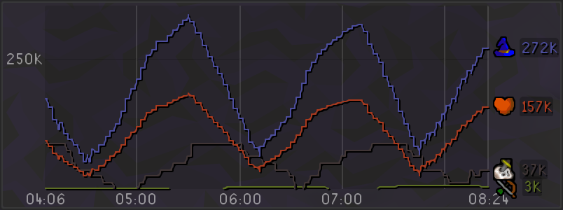
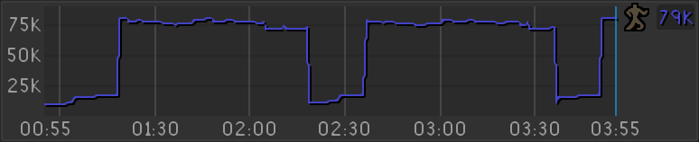
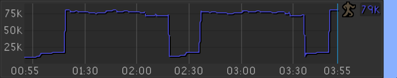
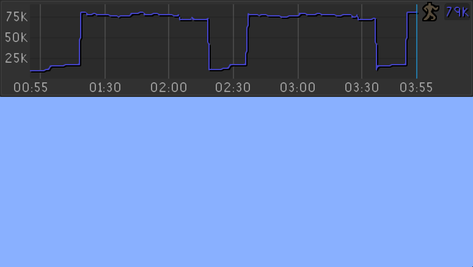
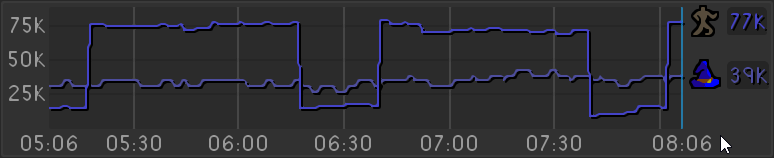
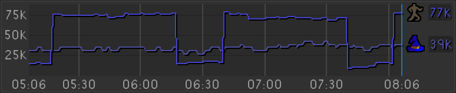

# XP Meter

Interactive XP/h Meter

## Features

* Tracks current XP/h rate of all skills, using a configurable time window
* Can be resized like any RuneLite overlay, and can be zoomed in
* Chart labels can be toggled off to provide a smaller, simpler chart
* Can be paused and reset via shift + right clicking the overlay

## Configuration

### Tracking settings

#### Tracking mode

Can be switched between **Sliding window** and **Cumulative**. 

**Sliding window** will average XP gain over the last X seconds, resulting in a more varied graph.

**Cumulative** will show accurate XP/h over the entire session, and will reflect RuneLite's XP/h.

#### Sliding window

Set the amount of time each XP rate point is averaged across. Use a smaller window for constant XP activities (like alching), and a higher window for activities with varying XP (combat, woodcutting (forestry)).

#### Resolution

Controls how frequently the chart is updated, and how far apart data points are. Smaller values will produce a blockier chart, large values will produce smoother lines.

### Display

#### Span

Controls the amount of time to display on the chart. Zooming via `shift`+`scroll` changes this value.

#### Chart height

Controls the height of the inner chart

#### Time labels, Time markers, XP labels, XP markers

Controls display of axis labels and markers in the chart

#### Display current rates

Show current XP rates at the end of each line

#### Display skill icons

Show mini skill icons at the end of each line

#### Long format numbers

Show all rates in a longer format. e.g. `69,420` instead of `69K`, or `1,200K` instead of `1M`

#### Show performance

Show debugging performance metrics like compute time / cache info.

Performance can deteriorate over long sessions, potentially to the point that it causes hitches on each chart update. If this happens, either:
- Zoom in / reduce span
- Increase the resolution
- Reset the chart

### Interactivity

#### Hover effects

Show momentary XP rates when hovering over the chart

#### Dim non-hovered skills

Dim other skills when hovering to make it easier to see the target skill's plot

#### Display all tooltips

Toggle between showing 1 or all skills when hovering over the chart

#### Scroll to zoom

Hold `shift` + `scroll` over the overlay to adjust the display span

